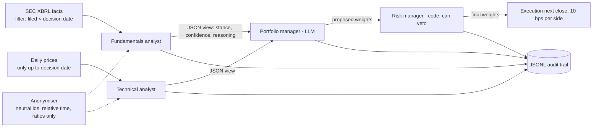

# blind-committee

[](https://github.com/CH4RL3I/blind-committee/actions/workflows/ci.yml)  

A small multi-agent "hedge fund" (Python package `agentfund`): LLM analysts who see anonymised
evidence, a portfolio manager who weighs their views, and a risk manager written in plain code.
It is built around one question that most LLM-trading demos skip: **does the model act on
analysis, or on memory of what happened?** It also asks the unfashionable second question:
**do the agents beat simple baselines at all?**

Short answer from the run below: no. They produced a lower-risk portfolio with a Sharpe ratio
statistically indistinguishable from equal weight, and less return. That is reported as found.

Not investment advice. This is a research and engineering exercise on a small model.

## Architecture



No agent framework. `llm.py` is one interface over local Ollama (default, `llama3.2`) and
optional Anthropic (`claude-haiku-4-5-20251001`, key from `ANTHROPIC_API_KEY`, never required).
Every agent output is a pydantic model; invalid JSON or schema violations are fed back to the
model and retried. The PM only proposes; `risk.py` enforces in code a 15% single-name cap, no
leverage or shorts, a 15% annualised volatility target (scales down only), a veto on names with
trailing volatility above 70%, a drawdown stop (halve exposure at 10%, cash at 20%, re-enter at
half). Every decision (inputs, each agent's JSON, PM rationale, risk actions, final weights) is
appended to a JSONL audit file; `results/run/audit_*.jsonl` are the real ones.

An example trace (2025-06-30, rendered from `audit_full.jsonl` by `agentfund report`):

**Decision 2025-06-30.** Asset shown to the models as `ASSET_03` (revealed here: META).

- **Fundamentals analyst** sees: revenue growth yoy 0.219, latest-quarter growth 0.161, net margin 0.379, operating margin 0.422, ...
  - view: **bullish**, confidence 0.70: strong revenue growth and profitability, high operating margin.
- **Technical analyst** sees: 1m return 0.145, 3m 0.281, 6m 0.216, 12-1 momentum 0.26, 60d vol 0.519, ...
  - view: **bullish**, confidence 0.70: positive momentum, but high RSI argues for caution.
- **Portfolio manager** proposes 10.0% for this asset (rest spread over ten names, 15% cash).
- **Risk manager (code)**: vol target: portfolio vol 16.5% -> 15.0%
- **Final weight** 9.1%; the portfolio holds 9 names, gross 49.9%

Full text: [docs/example_trace.md](docs/example_trace.md).

## The lookahead problem and the defences

An LLM trained on data through some date "knows" what NVDA did in 2023. A backtest that shows
it "NVDA, March 2023" measures recall, not reasoning. Three defences:

1. **Point-in-time data.** Fundamentals come from SEC `companyfacts`, and a fact is used only if
   its `filed` date is strictly before the decision date. The fiscal quarter ending 31 March is
   not knowable on 20 April; the 10-Q lands in May. Restated values are used only after the
   restatement was filed. Tests cover this, and I deliberately broke the filter once to confirm
   four tests fail (they did), then restored it. Price features use only closes up to the
   decision date (a test mutates future prices and checks features do not change).
2. **Anonymisation.** Assets become `ASSET_07`-style ids (seeded shuffle), tickers/company
   names/aliases are scrubbed from any text, time is relative ("T"), and the packets contain
   ratios only: no price levels, no dollar magnitudes, no calendar dates. The PM sees only ids;
   the id-to-ticker map is applied in code. Tests assert no identity, year or level leaks into
   an anonymised packet.
3. **Evaluation after the training cutoff.** I assume a **December 2023** knowledge cutoff for
   Llama 3.2 (Meta's stated figure; models are usually thin on their last months). Decisions run
   from 2024-01-31 to 2026-07-31, so every return being predicted lies after it.

**Leakage probe** (`agentfund probe-leakage`). For 12 assets x 6 dates before the cutoff and 12 x
6 after (72 samples per cell), the model gets the same evidence packet, raw (ticker, name, dates,
price and dollar levels) or anonymised, and must name the ticker, the year, and the next-month
direction. llama3.2 (3B), 95% Wilson intervals:

| Condition | Window | n | Ticker recalled | Year recalled | Direction correct (95% CI) | Up-rate (base) |
|---|---|---|---|---|---|---|
| anonymised | before cutoff | 72 | 0.0% | 31.9% | 44.4% [33.5%, 55.9%] | 61.1% |
| anonymised | after cutoff | 72 | 0.0% | 0.0% | 47.2% [36.1%, 58.6%] | 75.0% |
| raw | before cutoff | 72 | 100.0% | 100.0% | 44.4% [33.5%, 55.9%] | 61.1% |
| raw | after cutoff | 72 | 100.0% | 100.0% | 59.7% [48.2%, 70.3%] | 75.0% |


Reading it: anonymised, the model never names the right company (0 of 144), so the packet does not
give the asset away. Raw ticker/year recall is 100% only because they are in the prompt. The
memorisation signature would be high direction accuracy before the cutoff that falls after it and
under anonymisation; here direction accuracy is at or below a coin flip before the cutoff (44.4%,
while 61% of those months were up). The one above-50% cell is raw/after the cutoff, where the model
cannot have memorised anything; its interval includes 50% and it sits below the 75% base rate, so it
reflects bullish tilt, not recall. In the anonymised/after-cutoff cell the year guess is never
right because the model cannot name a year past its training data. **Conclusion for this model: no
detectable outcome recall. That is weak evidence for larger models,** whose recall is better; the
same probe can be pointed at them with `--model`.

## Backtest design

- Universe: AAPL, MSFT, NVDA, AMZN, GOOGL, META, JPM, CVX, JNJ, PG, KO, HD (12 large caps).
- Monthly rebalance: decide at the last trading day's close, trade at the next close. 31
  rebalances, 2024-01-31 to 2026-07-31, equity curve ends 2026-08-31.
- Costs: 10 bps per side on traded notional. Cash earns 0; Sharpe uses a 0% risk-free rate.
- Baselines: equal weight (monthly), buy-and-hold SPY, 12-1 momentum (top 4, equal weight).
- Ablations: drop each analyst; drop the risk manager; replace the LLM PM with a mechanical
  rule over the same analyst views (score = mean of stance x confidence, long the positives).
- Uncertainty: 95% circular block-bootstrap (21-day blocks, 2,000 draws) on daily returns; stance
  hit rates with Wilson intervals.
- **Size and compute:** 744 analyst calls (31 dates x 12 assets x 2 analysts) and 31 PM calls per
  PM-based configuration, all on local llama3.2, cached so ablations reuse analyst output. At
  roughly 2-3 s per call on an idle machine that is about 30-40 minutes. On the shared machine
  used here (load average well above 100, probe running concurrently) the real wall-clock was about
  80 minutes; the run was interrupted once and resumed from the call cache. Zero schema-validation
  retries or failures occurred (structured decoding), and zero PM fallbacks.

## Results


| Strategy | Total return | Ann. return | Ann. vol | Sharpe (95% CI) | Max drawdown | Turnover / rebalance |
|---|---|---|---|---|---|---|
| Agents (full) | +41.3% | +14.4% | 9.0% | 1.54 [0.30, 2.76] | -9.2% | 13.2% |
| Agents without fundamentals | +9.1% | +3.5% | 7.0% | 0.52 [-0.65, 1.69] | -8.2% | 17.7% |
| Agents without technical | +22.4% | +8.2% | 7.5% | 1.08 [0.03, 2.15] | -8.5% | 9.1% |
| Agents without risk manager | +42.7% | +14.9% | 9.2% | 1.56 [0.31, 2.77] | -9.2% | 13.6% |
| Rule-based PM (same views) | +60.0% | +20.1% | 13.5% | 1.42 [0.25, 2.60] | -13.8% | 13.5% |
| Equal weight | +76.3% | +24.7% | 14.4% | 1.61 [0.48, 2.88] | -17.7% | 4.1% |
| SPY buy & hold | +61.4% | +20.5% | 15.8% | 1.26 [0.26, 2.48] | -18.8% | 50.0% (entry only) |
| Momentum top-4 | +102.7% | +31.7% | 25.3% | 1.21 [0.19, 2.42] | -29.5% | 22.0% |

What the numbers say, and do not say:

- The full agents return less than every baseline (+41% vs +76% equal weight, +61% SPY) but with
  the lowest drawdown (-9%). Sharpe 1.54 vs 1.61 for equal weight: the paired bootstrap interval for
  the difference is [-0.88, +0.61], so no claim either way. With 31 rebalances and one bull-market
  regime, every interval is wide; do not rank the Sharpe ratios.
- Most of the gap is under-investment, not stock picking: the LLM PM held on average 43% gross
  (the rest in cash at 0%). The risk manager rarely binds (removing it barely changes anything).
- The same analyst views fed through a mechanical rule earn more than the LLM PM (+60% vs +41%):
  in this run the LLM PM added nothing over a dumb aggregator, mainly by being more cautious.
- Ablation: dropping an analyst lowers return (especially fundamentals), but the intervals
  overlap heavily and the effect is confounded with how invested each variant is. Suggestive, not
  proven.
- Stance hit rate (did a bullish/bearish call beat / lag the universe average over the next
  month): fundamentals 51.7% [45.7%, 57.7%] on 263 non-neutral calls; technical 41.1% [34.1%,
  48.5%] on 175 (almost never bearish: 3% of calls). Neither is distinguishable from a coin flip
  in a useful direction.

## Limitations

- Survivorship and selection: the universe is today's large caps, picked with hindsight, in a
  strongly rising market. This flatters all long-only strategies, including the baselines.
- One 3B local model, one seed, one 31-month window. A stronger model could do better (or leak more).
- The probe tests recall in this model only; absence of leakage here does not transfer. The
  anonymised packets could still carry a fingerprint (for example a distinctive growth pattern).
- The fundamentals analyst sees no valuation multiples; XBRL tag coverage varies by company
  (banks lack some lines), and missing values are shown as null.
- Universe change worth knowing: XOM was replaced by CVX. After ExxonMobil's 2026 holding-company
  reorganisation, SEC's ticker map points XOM to the new filer (ExxonMobil Holdings Corp, CIK 2115436),
  whose XBRL facts start in August 2026. The pre-2026 history still sits under the old Exxon Mobil Corp
  filer (CIK 34088); stitching the two is a possible fix, not done here.
- Prices come from Yahoo Finance via `yfinance` (adjusted closes). Stooq was the first choice but
  now serves a JavaScript proof-of-work page to scripted clients instead of CSV.
- Stateless drawdown rules and a 10 bps cost are simplifications; no taxes, borrow or slippage.

## Usage

```bash
uv sync
export SEC_USER_AGENT="yourproject you@example.com"   # required by the SEC; never committed
ollama pull llama3.2
uv run agentfund run --start 2024-01-01 --end 2026-08-31
uv run agentfund probe-leakage
uv run agentfund report            # figures to docs/, tables printed
uv run pytest -q                   # offline, LLM mocked, 28 tests
```

Data and caches live in `data/` (git-ignored). Raw price data is not redistributed; the committed
`results/` holds derived outputs only (metrics, weights, audit trails with computed features and
model outputs, probe results). `results/run/equity.csv` is derived from Yahoo prices and is
therefore not committed; `agentfund run` re-creates it (`report` needs it for the equity figure).

## License

MIT, (c) 2026 Emilio Gappa.
