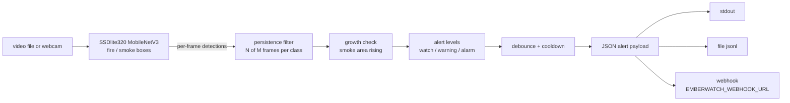

# emberwatch

[](https://github.com/CH4RL3I/emberwatch/actions/workflows/ci.yml)  

Real-time industrial fire and smoke detection with temporal alerting, evaluated honestly, including false alarms.

> **Not a certified safety device.** emberwatch is a research and portfolio project. It has not been validated on industrial cameras, is not certified under any fire-detection standard (for example EN 54 or UL 268), and **must not replace certified fire detectors or alarm systems**. Do not rely on it to protect people or property.


The GIF shows the detector's boxes and the alert level over time for one synthetic positive clip and one negative clip. It contains no dataset pixels: only boxes, timelines and text are drawn (see [data terms](#data-and-terms)).

## Why this project

In a safety system, a detector that finds every fire but cries wolf every few minutes gets switched off. So the question is not only "what is the recall" but "what does the operator pay for it in false alarms per hour, and how late is the alert". emberwatch fine-tunes a small detector on D-Fire, puts a temporal alert layer on top (persistence, growth check, debounce, cooldown, three alert levels, JSON payloads to pluggable sinks), and measures recall, false alarms per hour and time-to-alert together.

The headline result is a sobering one, and it is reported as it came out:

- The detector is modest (mAP@0.5 = 0.41; fire 0.26, smoke 0.56) and, at the operating point chosen for best F1, raises a false alarm on 35% of negative images and 54% of fire-coloured ones.
- Temporal logic turns a per-frame alarm on 34% of negative frames into warning-level episodes, and gives up 3.5 s median delay for that. But on static scenes a false positive is persistent, so a longer persistence window helps far less than raising the score threshold does.

Details and caveats below.

## Pipeline



Alert rules (all in `src/emberwatch/alerts.py`, deterministic, independent of the detector and of wall-clock time):

| level | condition (after N-of-M persistence per class) |
|---|---|
| watch | smoke persistent |
| warning | fire persistent, or smoke persistent and its area grew (newer half of the window at least 1.25x the older half) |
| alarm | fire and smoke both persistent, or warning sustained for a full window |

Levels rise immediately, fall only after a debounce period, and repeated alerts at the same level are suppressed during a cooldown (escalations to a higher level always go through). Example payload (from `emberwatch watch`):

```json
{"schema_version": "1.0", "type": "emberwatch.alert", "camera_id": "cam-0", "level": "warning",
 "level_value": 2, "timestamp_s": 2.96, "frame_index": 74,
 "reason": "persistent smoke with growing area",
 "evidence": {"fire_hits": 0, "smoke_hits": 75, "window": 75, "smoke_growth": true,
              "max_fire_score": 0.0, "max_smoke_score": 0.851},
 "disclaimer": "Not a certified fire detection device."}
```

## Results

Full tables: [docs/results.md](docs/results.md). Everything is generated from `runs/*.json` by `emberwatch eval` and `emberwatch render`.

### Detector (held-out D-Fire test split, 4,306 images, IoU 0.5)

| class | AP@0.5 | threshold | precision | recall |
|---|---|---|---|---|
| fire | 0.263 | 0.20 | 0.392 | 0.282 |
| smoke | 0.562 | 0.50 | 0.640 | 0.540 |
| mean | 0.413 | | | |

Thresholds maximise box-level F1 on a 5% validation carve-out of the train split, never on test. Precision and recall are box-level at those thresholds. Image-level, 73% of test images that contain fire or smoke get at least one detection.


Fire is much weaker than smoke: fire boxes are small (mean 2.4% of the image area against 22.6% for smoke, over all annotations) and the model sees 320x320 inputs. This is a 35-minute fine-tune of the smallest reasonable model, not a tuned system.

### False alarms

Image level, negative test images (no fire or smoke annotated), at the operating thresholds:

| subset | images | false-alarm rate |
|---|---|---|
| all negatives | 2,005 | 35.2% |
| fire-coloured (top 15% by orange/red pixel share) | 300 | 54.0% |
| hazy / low-contrast (bottom 15% by contrast + saturation) | 300 | 37.3% |

D-Fire has no scene tags, so hard negatives are mined by colour statistics from the untagged negatives. These subsets approximate "sunsets, orange clothing, red lights" and "fog, haze, steam"; they are not curated labels, and some members will be easy images.

Video level, on synthetic clips (method below; 150 positive clips, 200 negative clips of 30 s each, 1.67 h of negative footage; 2 simulated fps):

| system | recall | median time-to-alert | false alarms |
|---|---|---|---|
| frame level: any detection above threshold alarms | 96.7% | 0.5 s | 34.1% of negative frames; 50.5% of negative clips have at least one |
| temporal, warning or higher (M=6, N=4, thr 0.2/0.5) | 80.7% | 3.5 s | 75 episodes/h |
| temporal, alarm | 44.0% | 5.5 s | 26 episodes/h |
| temporal, warning, growth check off | 37.3% | 5.0 s | 52 episodes/h |

Read this table carefully. "Frames per hour" and "episodes per hour" are not the same unit, so the frame-level row and the temporal rows are not a like-for-like false-alarm rate; the comparable numbers are the fraction of negative clips that ever alarm at frame level (50.5%) versus the sweep below.

### Recall vs false alarms as the knobs move


- **Persistence window M** (N = ceil(0.67 M), warning level): recall 0.59 to 0.86 and false-alarm episodes/h falling only from about 71 (M=2) to 52 (M=16), while median delay grows from 3.0 s to 6.5 s. The window mostly buys back delay, not false alarms, because a false positive on a static scene is persistent, not flicker. What it does remove is flicker: in the hero GIF the negative clip fires raw detections on and off and never leaves CLEAR.
- **Score threshold** (M=6, both classes): moving from 0.3 to 0.9 takes false alarms from 86 to 8 episodes/h, at recall 0.87 to 0.60 and a delay of 3.0 s to 5.5 s. This is the far more effective knob in these experiments.
- **Growth check**: with it, smoke-only events can reach warning (recall 0.81 against 0.37 without). It costs false alarms (75 against 52 episodes/h), which is the honest price.
- The window curve is not monotone at small M: with M=1 the growth check cannot run, so smoke-only clips stay at watch.

Real-time throughput (`emberwatch watch`, 960x540 25 fps mp4, 300 frames, MPS, batch 1, 4 torch threads, shared 16 GB M1 Pro): **42 fps end to end** including decode, resize, inference and alert logic; detector latency mean 23.3 ms, p95 25.9 ms. Measured with other jobs running on the machine; treat it as indicative.

## Method

**Data.** D-Fire, the whole dataset (21,527 images, boxes for fire and smoke, about 47% negatives), downsized to 320x320 JPEGs and cached under `data/` (517 MB). Official train split minus a deterministic 5% validation carve-out (16,391 train, 830 val) and the official test split (4,306) as held-out. Raw class ids are 0 = smoke and 1 = fire; checked against box sizes.

**Detector.** torchvision SSDlite320 with a MobileNetV3-Large backbone, COCO-pretrained, classification convs replaced for background, fire and smoke. AdamW, cosine schedule with warm-up, horizontal-flip augmentation, batch 16, 5,313 steps (about 85,000 images, 5 epochs) in 35 minutes on the MPS backend.

**Metrics.** Per-class AP with all-point interpolation (VOC 2010+ style) at IoU 0.5, own implementation in `metrics.py`, tested on a toy example with known answers.

**Synthetic clips.** D-Fire is images only (its surveillance videos are not scriptable to download). Clips are built from still images, so treat the video-level numbers as a controlled simulation of the alert logic, not as field performance:

- Negative clip: one negative image seen by a static camera with per-frame jitter (translation, slow zoom, brightness flicker, sensor noise), 60 frames at 2 fps.
- Positive clip: the same, with the annotated fire and smoke regions first inpainted away (OpenCV Telea); the original pixels are then revealed inside ellipses that grow from 15% to 100% of each ground-truth box over 10 s, starting at frame 10 (5 s). This gives a known onset and a growing region with real pixels.
- Negative clips: 120 random negatives, plus the 40 most fire-coloured and 40 most hazy test negatives.
- Detections are computed once per frame and the alert engine is replayed offline for each configuration. A false-alarm episode is one upward crossing into the given level or above; a positive clip counts as detected if that level is reached at or after onset.

Consequences of this construction: the frames of a clip are strongly correlated, scenes are independent draws, and 1.67 h of footage is small. The false-alarms-per-hour figures are relative measures for comparing settings, not predictions for any camera.

## Usage

```bash
uv sync
uv run emberwatch fetch                      # ~3 GB of downloads, cached to 517 MB in data/
uv run emberwatch train --minutes 35         # ~35 min on an M1 Pro (MPS), writes checkpoints/
uv run emberwatch eval                       # mAP, false alarms, clip simulation -> runs/*.json
uv run emberwatch render --bench-video       # docs/*.png, hero.gif, results.md, fps benchmark
uv run emberwatch watch --source 0 --show    # webcam; or a video path
uv run emberwatch watch --source clip.mp4 --sink file:alerts.jsonl
EMBERWATCH_WEBHOOK_URL=https://example.org/hook uv run emberwatch watch --source 0 --sink webhook
```

Tests are offline and fast (detector mocked, no data needed): `uv run pytest`. They cover IoU and NMS, mAP on a toy example, the alert state machine (persistence, cooldown, escalation, debounce), and the payload schema.

## Data and terms

- Dataset: D-Fire, Venancio, Lisboa and Barbosa, gaiasd/DFireDataset (repository moved to gaia-solutions-on-demand/DFireDataset). Its LICENSE file states the images are public-domain material the authors do not hold copyright over, and releases the collection under CC0 1.0. Please cite the paper below if you use it.
- `emberwatch fetch` uses a Hugging Face parquet mirror (badsaarow/d-fire), because the authors' OneDrive links cannot be scripted. That mirror declares no licence, and a different mirror labels the same data CC BY 4.0; I treat the upstream CC0 statement as the governing one but could not independently verify the provenance of each image.
- Because of that uncertainty, **no dataset image, label or derived weight is committed** (`data/`, `checkpoints/`, `runs/` are gitignored). The GIF and figures contain only boxes, curves and text.
- Dependencies (all permissive): torch and torchvision (BSD-3), numpy (BSD-3), pillow (HPND), pyarrow (Apache-2.0), matplotlib (PSF-style), opencv-python (MIT packaging of Apache-2.0 OpenCV; the wheels bundle LGPL FFmpeg). Dev: pytest (MIT), ruff (MIT). No ultralytics or YOLO code is used.
- Model weights: torchvision's COCO-pretrained SSDlite320 MobileNetV3-Large, used as initialisation and released by torchvision under its BSD-3 repository terms; fine-tuned weights are produced locally and not distributed.

## Limitations

- **Domain gap.** D-Fire is mostly web-collected and ground-level imagery (wildland, roadside, buildings). Industrial cameras differ in mounting height, optics, lighting, infrared use, machinery, welding arcs, flares, steam and dust, none of which are represented. No result here transfers to a plant without site-specific data.
- **Weak detector.** mAP@0.5 of 0.41 is far from state of the art; small fires at 320 px are often missed (fire recall 0.28 at the operating point).
- **High image-level false-alarm rate**, especially on fire-coloured scenes. The F1-optimal threshold is not a safety-appropriate threshold; the sweeps show what a stricter one costs.
- **Synthetic video.** Clips come from single images with jitter, not real fire dynamics: no flicker, no smoke plume motion, no camera motion beyond slight jitter. Persistent per-scene false positives are therefore over-represented relative to a real camera that sees changing scenes, and real smoke onset is slower or faster than the ramp.
- **Small samples.** 150 positive clips and 1.67 h of negative footage; no confidence intervals are reported. Differences of a few points in the sweep tables are within noise.
- **Hard negatives are mined heuristically**, not curated.
- **Single run.** One training run, one seed.
- **Not certified**, as stated at the top.

## References

- P. V. A. B. de Venancio, A. C. Lisboa, A. V. Barbosa. An automatic fire detection system based on deep convolutional neural networks for low-power, resource-constrained devices. Neural Computing and Applications, 2022 (the D-Fire dataset).
- P. V. A. B. de Venancio, R. J. Campos, T. M. Rezende, A. C. Lisboa, A. V. Barbosa. A hybrid method for fire detection based on spatial and temporal patterns. Neural Computing and Applications, 2023.
- W. Liu et al. SSD: Single Shot MultiBox Detector. ECCV 2016.
- A. Howard et al. Searching for MobileNetV3. ICCV 2019.
- T.-Y. Lin et al. Microsoft COCO: Common Objects in Context. ECCV 2014.
- M. Everingham et al. The PASCAL Visual Object Classes (VOC) Challenge. International Journal of Computer Vision, 2010 (average precision definition).
- A. Telea. An image inpainting technique based on the fast marching method. Journal of Graphics Tools, 2004.

## Licence

MIT, Copyright (c) 2026 Emilio Gappa. See [LICENSE](LICENSE).
