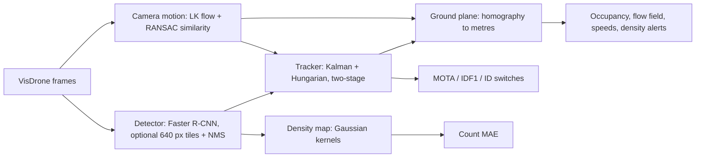

# hivemap

[](https://github.com/CH4RL3I/hivemap/actions/workflows/ci.yml)  

Aerial crowd analysis from drone video: person detection, multi-object tracking, density maps and ground-plane analytics, evaluated against the labelled ground truth of the VisDrone-MOT benchmark.


The GIF is rendered on an empty canvas (no dataset pixels): tracked boxes with trails, and the Gaussian density map computed from the detections. Sequence `uav0000086_00000_v`, tiled detector.

## Results

Evaluated on 4 VisDrone2019-MOT validation sequences, 70 frames each (every 3rd annotated frame, about 10 fps effective), 280 frames in total. All numbers are produced by `hivemap eval` and listed in full in [docs/results.md](docs/results.md). The detection threshold (0.5) and all tracker parameters were fixed before evaluation; nothing was tuned on these sequences.

| variant | AP@0.5 | precision | recall | MOTA | IDF1 | ID switches | count MAE (mean GT 31.2) |
|---|---|---|---|---|---|---|---|
| full-frame | 0.586 | 0.648 | 0.647 | 0.233 | 0.488 | 317 | 4.92 |
| tiled (640 px) | 0.616 | 0.560 | 0.697 | 0.006 | 0.445 | 417 | 8.91 |

Means over the four sequences (ID switches summed). Per-sequence spread is large: full-frame MOTA ranges from 0.008 to 0.559.

What the numbers say, without polish:

- Detection on drone footage is mediocre with a COCO-pretrained model and no fine-tuning. Recall for people under 40 px tall is 0.31 (full-frame) and 0.39 (tiled); for people over 110 px it is 0.76 and 0.80.
- Tiling helps recall and AP (+0.03 AP) and helps small people most, but at a fixed 0.5 threshold it adds false positives. That lowers precision and drags MOTA down to about zero, and count error rises. Some of those "false positives" are likely people the VisDrone labels do not cover (class "others", occluded or unlabelled), which I did not separate out. At threshold 0.7 the pooled F1 of both variants is about 0.67.
- Tiling costs about 4.5x the runtime.
- Camera-motion compensation matters: without it, ID switches rise from 317 to 781 (full-frame) and IDF1 falls from 0.49 to 0.34.
- Density-map integral equals the detection count by construction, so its count error is the detector's count error. The GT count includes people no detector at this resolution finds, hence a negative bias on some sequences and a positive one on others.

### Runtime

Per-frame time on an Apple M1 Pro (16 GB) using MPS, single stream, 1344 px wide input:

| stage | time |
|---|---|
| detection, full-frame | 0.6 s (clean benchmark, `hivemap bench`, median of 8 frames) |
| detection, tiled (6 tiles + full frame) | 3.3 s |
| camera-motion estimate | about 0.1 s |
| Kalman tracker + association | 2 to 3 ms |
| density map (quarter resolution) | 5 to 7 ms |

That is roughly 1.5 fps full-frame and 0.3 fps tiled: offline analysis, not real time. The figures in `docs/results.md` are slower (1.6 s and 7.3 s mean) because the evaluation ran while other heavy jobs shared the machine; I report both. CPU-only was tens of seconds per frame on the loaded machine and is not benchmarked.

### Ground-plane analytics

No ground truth exists for metric quantities, so this part is an illustration with one weak sanity check. Median track speeds: 0.73 and 0.86 m/s on two sequences (plausible for a slow crowd) but 2.35 and 3.57 m/s on the other two, which is not plausible for pedestrians. Likely causes are jitter and ID switches inflating speeds, the assumed 30 fps source rate, and scale error in the estimated geometry. I treat the metric speeds as unvalidated. The density alert (threshold 0.5 persons per m2 over a 2 m Gaussian window) never fired: peak local density was 0.25 to 0.33 persons per m2. Figures: `docs/ground_<sequence>.png`, `docs/counts.png`, `docs/recall_by_height.png`.

## Pipeline



## Method

- **Detection.** torchvision Faster R-CNN ResNet-50 FPN v2 with COCO weights, person class, score floor 0.05. Tiled mode also runs 640 px windows (25 percent overlap), drops boxes cut by interior tile edges and merges with the full-frame pass by NMS at IoU 0.5. Frames wider than 1344 px are shrunk first and boxes mapped back. An RT-DETR backend (Apache-2.0) exists in the code but was not evaluated.
- **Tracking.** Written from scratch: constant-velocity Kalman filter over (cx, cy, w, h) with size-scaled noise, IoU cost, Hungarian matching (`scipy.optimize.linear_sum_assignment`), ByteTrack-style two-stage association (confident detections first, then low-confidence ones for remaining recently seen tracks). Camera motion is estimated per frame (Lucas-Kanade features, RANSAC similarity fit) and applied to the Kalman states.
- **Metrics.** CLEAR-MOT (MOTA, ID switches) and IDF1 implemented in `metrics.py` from their definitions and tested on toy cases with known answers; IoU threshold 0.5. Detection AP is single-class VOC-style all-point AP at IoU 0.5. Person means VisDrone classes pedestrian and people with score 1; ignored regions remove detections that fall mostly inside them. I did not cross-check against `motmetrics` or the official VisDrone toolkit, so numbers are not directly comparable to published leaderboard values (which are also per-class and on the full test sets).
- **Density.** Unit impulses at box centres blurred with a Gaussian with reflective borders, so the integral equals the count exactly (tested).
- **Ground plane.** Flat ground, pinhole camera, zero roll, assumed 80 degree horizontal field of view, assumed 1.7 m person height. Camera pitch and height are fitted so predicted heights of a 1.7 m person match the detected box heights (robust least squares); this gives a ground homography to metres. Camera motion is composed across frames so a fixed plane can be used. Flow and speed come from central differences over track foot points, assuming a 30 fps source.

## Usage

```
uv sync
uv run hivemap fetch                        # about 400 MB, four validation sequences
uv run hivemap run uav0000086_00000_v       # tracks, metrics, ground figure in runs/
uv run hivemap eval                         # writes docs/results.md and figures
uv run hivemap render uav0000086_00000_v    # docs/hero.gif
uv run hivemap bench                        # detector timing
uv run pytest -q                            # 36 offline tests
```

`fetch` reads the zip index of the official validation archive with HTTP range requests and downloads only the chosen sequences, so the full 1.5 GB archive is never pulled. Data goes to `data/` (gitignored). Model weights are downloaded by torchvision into its own cache, never into the repo.

## Data terms

VisDrone (Zhu et al., AISKYEYE group, Tianjin University) is obtained from the links in the official repository, https://github.com/VisDrone/VisDrone-Dataset. That repository and the project site state no licence; the README says test-dev annotations may be used to publish papers and asks for citation. I therefore treat the data as research-use-only, cite the paper below, and redistribute no frames: the repo contains no dataset images, and the GIF is drawn on an empty canvas. If you reuse this, check the current terms yourself.

## Licences

Code: MIT. Dependencies: numpy, scipy, torch, torchvision (BSD-3); transformers (Apache-2.0); opencv-python-headless (Apache-2.0); pillow (HPND); matplotlib (PSF-style); typer (MIT); dev: pytest (MIT), ruff (MIT). Model: torchvision `FasterRCNN_ResNet50_FPN_V2_Weights.COCO_V1`, trained on COCO (annotations CC BY 4.0); I relied on torchvision's BSD-3 licensing of its released weights and did not audit the weights individually. No AGPL code (no `ultralytics`).

## Limitations

- Small evaluation subset: 280 frames of four sequences; variance between sequences is large, so differences of a few points are not meaningful.
- Domain shift: the detector is COCO-pretrained and never fine-tuned on aerial views. Bigger gains would come from fine-tuning on VisDrone-DET, which I did not do.
- Ground plane: a flat plane, guessed field of view, guessed person height, no intrinsics, no measured scale. Metric outputs are approximate and partly failed the speed sanity check above. Sloped terrain, stairs and multi-level scenes break the model.
- Sampling at about 10 fps makes association harder than at the native rate.
- Runtime numbers are from one shared machine.

## Privacy and ethics

Crowd analytics from aerial video can be used for surveillance. This project produces aggregate counts, tracks of anonymous boxes and density fields, stores no identities and does no face or attribute recognition, but tracks of individuals can still be re-identifying in small scenes. Deployments need a lawful basis, signage or consent where required, data minimisation and retention limits. Flow and density alerts are best used for safety (crowd crush risk, evacuation) rather than for monitoring individuals. The accuracy reported here is too low to support any decision about a real person.

## References

- P. Zhu, L. Wen, D. Du, X. Bian, H. Fan, Q. Hu, H. Ling. Detection and Tracking Meet Drones Challenge. IEEE TPAMI 44(11), 2021.
- S. Ren, K. He, R. Girshick, J. Sun. Faster R-CNN. NeurIPS 2015.
- Y. Zhang et al. ByteTrack: Multi-Object Tracking by Associating Every Detection Box. ECCV 2022.
- A. Bewley et al. Simple Online and Realtime Tracking (SORT). ICIP 2016.
- K. Bernardin, R. Stiefelhagen. Evaluating Multiple Object Tracking Performance: the CLEAR MOT Metrics. EURASIP JIVP 2008.
- E. Ristani et al. Performance Measures and a Data Set for Multi-Target, Multi-Camera Tracking (IDF1). ECCV workshops 2016.
- W. Lv et al. DETRs Beat YOLOs on Real-time Object Detection (RT-DETR). CVPR 2024.
- T.-Y. Lin et al. Microsoft COCO: Common Objects in Context. ECCV 2014.

## Licence

MIT, Emilio Gappa, 2026.
