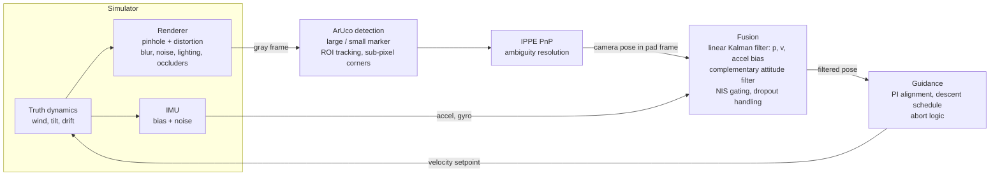

# touchdown

[](https://github.com/CH4RL3I/touchdown/actions/workflows/ci.yml)  

Vision-based drone landing perception in simulation: detect a landing pad, estimate the drone's
pose relative to it, generate landing guidance, and close the loop so the simulated drone lands.
Everything is scored against the known ground truth over 100 Monte-Carlo descents.

**This is a simulation study. Nothing here has been flown or tested on hardware.** See
[Limitations](#limitations-and-sim-to-real-gaps) for what the simulator does not capture.


*One descent from about 10 m (seed 1000, the first seed of the evaluation set, not hand-picked; it landed 3.5 cm from the centre against a 9.9 cm median). Green: detected marker. Axes:
filtered pad pose. Red cross: ground-truth pad centre. Inset: top view, white = truth, cyan =
estimate. The grey box is the detection region of interest.*

## Results

100 closed-loop landings, seeds 1000-1099, nuisance level 0.5 (moderate noise, blur, lighting
change and one occluder on the pad). Every run starts at 9-11 m altitude with a 0.5-3 m lateral
offset, random wind, attitude oscillation and IMU bias.

| Metric | Value |
| --- | --- |
| Landings completed | 86 / 100 |
| Landed within 25 cm of the pad centre ("success") | **84 / 100** |
| Touchdown error, completed landings (radial) | median 9.9 cm, mean 11.1 cm, 90th pct 18.6 cm, max 57.6 cm |
| Runs that did not land | 13 aborted "marker lost too long", 1 aborted "excessive lateral error near ground" |
| Detection rate above 0.6 m altitude | 93.3 % of frames |
| Per-frame CPU time (detect + PnP + filter + guidance) | mean 2.7 ms, p95 7.1 ms, p99 8.3 ms |

The 13 aborts are the safety logic working as designed rather than crashes: an occluder covering
the pad for 1-3 s outlasts the 2 s "marker lost" limit, so the drone goes around. The abort
threshold is a design choice, and moving it trades aborts against risk; I did not tune it to
inflate the success rate.

**Pose error vs altitude, raw PnP vs filtered** (median / 90th percentile over all frames in the
bin; truth from the simulator):

| True altitude | Position, raw PnP | Position, filtered | Attitude, raw PnP | Attitude, filtered |
| --- | --- | --- | --- | --- |
| 9 - 11.5 m | 28.9 / 87.2 cm | 21.9 / 64.4 cm | 1.64 / 5.05 deg | 1.06 / 2.63 deg |
| 5 - 7 m | 13.0 / 31.4 cm | 11.6 / 28.8 cm | 1.22 / 2.79 deg | 0.76 / 1.99 deg |
| 2 - 3 m | 2.3 / 18.5 cm | 1.9 / 9.0 cm | 0.47 / 4.54 deg | 0.38 / 1.62 deg |
| 1 - 2 m | 2.4 / 9.1 cm | 2.0 / 8.8 cm | 0.94 / 3.28 deg | 0.53 / 1.72 deg |
| 0.5 - 1 m | 0.6 / 1.8 cm | 0.6 / 2.2 cm | 0.39 / 1.20 deg | 0.27 / 0.79 deg |

Raw PnP error grows roughly in proportion to altitude squared over the marker size, which is why
the large marker is used from far away. The filter mostly helps at the 90th percentile (it
rejects and bridges bad frames) and at long range (25-40 % lower median position error above
7 m). Near the ground it adds little in median terms: vision is already accurate, and what
matters is the last 0.6 m, where the marker leaves the field of view and the estimate is dead
reckoned. That blind phase, not perception noise, dominates the touchdown error.
Below 0.5 m the chart even shows the filtered line above raw (median 9.4 mm vs 1.9 mm). That is a
selection effect, not a filter bug: raw error only exists on the 24 % of frames that still detect the
marker, while the filtered estimate is scored on every frame, including dead-reckoned ones.


**Detection and robustness.** Detection rate by altitude is in the left panel (the small marker
takes over below about 2 m; below 0.5 m the pad leaves the frame, so a low rate there is
geometry, not failure). The right panel sweeps the nuisance level. Each level uses only 8 runs, so
treat the success curve as indicative.

| Nuisance level | 0.0 | 0.25 | 0.5 | 0.75 | 1.0 |
| --- | --- | --- | --- | --- | --- |
| Detection rate (above 0.6 m) | 98.3 % | 95.6 % | 95.5 % | 83.2 % | 72.8 % |
| Landing success (8 runs) | 8 / 8 | 7 / 8 | 7 / 8 | 4 / 8 | 2 / 8 |


**Runtime.** Per-frame CPU time is measured with `time.process_time` on a single thread (Apple
M1 Pro, OpenCV limited to one thread), excluding the simulator's rendering. Mean 2.7 ms
corresponds to about 370 fps of perception throughput; p95 is 7.1 ms, so even the
slow frames (full-frame re-acquisition) fit inside a 33 ms budget at 30 Hz, with a worst case of
14.1 ms in 31,194 frames. This is CPU time, not end-to-end latency, and it is
laptop-class silicon, not an embedded flight computer.


## Pipeline



## Method

**Simulator.** The pad is a 1.8 m white square carrying a nested ArUco board: a 1.2 m marker
(DICT_4X4_250) with a 0.18 m marker printed in a white hole at its centre. Both share the pad
origin, so either one gives the pose of the same frame. The large marker is detectable from about
12 m, the small one from about 7 m down to touchdown. Frames are rendered with a pinhole camera
(640x480, f = 520 px, radial and tangential distortion) by warping mip-mapped textures for the
pad and a gravel-like ground with distractor patches. Nuisances scale with one level parameter:
motion blur from the true image-plane speed, defocus, Gaussian noise, gain/offset drift, an
illumination gradient, vignetting, and elliptical occluders lying on the pad plane for 1-3 s.
Perspective at tilt comes from the attitude model (oscillation of 2-6 degrees plus a tilt
coupled to commanded acceleration). The drone follows a first-order velocity-tracking model with
steady wind plus Ornstein-Uhlenbeck gusts. A simulated IMU adds bias and white noise to the true
specific force and angular rate. Everything random comes from one seed through separate streams,
so `landsim run --seed N` is reproducible bit for bit.

**Perception.** Perception is handed a calibration that is deliberately slightly wrong (focal
length 0.2 % off, principal point about 0.5 px off, distortion coefficient 5 % off). Corners are
found by ArUco and refined with `cornerSubPix` at full resolution. The small marker inside the
large one broke the stock ArUco detector at mid range: the pad-edge quad swallows the marker
candidate, and the large marker vanished between about 2 and 8 m. The fix is two detectors, ArUco3
for the large marker and the standard one for the small marker. Pose comes from
`solvePnPGeneric` with `SOLVEPNP_IPPE_SQUARE`, which returns two candidates. Picking the one
nearest the filter's attitude looked natural, but it locked onto the wrong branch and drifted to
40 degrees error in one debugging run. The current rule takes the lower reprojection error and uses
the prior only to break near ties. Marker choice switches by altitude with hysteresis (large above
2.0 m, small below 1.6 m), falling back to whichever is visible. Once the pad is tracked, detection
runs on a region of interest around the predicted footprint, and at low altitude on a
half-resolution image.

**Fusion.** A linear time-varying Kalman filter carries position, velocity and accelerometer bias
in the pad frame. The IMU drives the prediction (specific force rotated by the attitude estimate,
plus gravity); each PnP position is a measurement whose noise scales with altitude and apparent
marker size. Updates are gated on NIS (chi-square, 3 dof, 99.9 %), and after 10 consecutive
rejections the filter reinitialises from vision. A complementary filter integrates the gyro and
pulls toward the PnP attitude with a gain that grows with marker size, and estimates a small
gyro bias. During dropouts the filter simply predicts; its covariance grows and guidance sees
how stale the estimate is.

**Guidance.** Lateral velocity is a PI law on the estimated pad-relative position with saturation
(2 m/s) and integral clamping. Descent speed is 0.3 s^-1 times altitude, clipped to 0.35-1.5 m/s,
and throttled to zero when the lateral error exceeds a corridor that widens with altitude. Below
0.6 m the drone commits: it descends at 0.35 m/s and keeps flying on the filter even if the marker
is out of view. Aborts (go-around climb): marker lost more than 2 s above the commit altitude,
lateral error above 0.45 m below 1 m altitude (tolerance widens with the estimate's staleness), or
no marker acquired within 4 s. Touchdown is when the true camera altitude reaches 0.15 m.

**Evaluation.** A run is a success if it lands within 25 cm of the pad centre. Detection rate is
the fraction of frames with an accepted marker pose, quoted above 0.6 m where the pad is in view.
Pose errors are computed per frame against the simulator truth (position: Euclidean; attitude:
geodesic angle). The 100 Monte-Carlo seeds (1000-1099) were not used while developing the
system, which used seeds 0-24. That protects against overfitting to specific seeds, not to the
simulator itself.

## Usage

```bash
uv sync
uv run landsim run --seed 3                 # one closed-loop descent, JSON summary
uv run landsim eval --runs 100 --out docs   # Monte Carlo + figures (about 20 min on 2 processes)
uv run landsim video --seed 1000 --gif docs/descent.gif --mp4 descent.mp4
uv run pytest -q                            # 25 tests
uv run ruff check . && uv run ruff format --check .
```

`landsim eval` never uses more than two worker processes.

## Tests

Twenty-five fast tests cover: a projection-to-PnP round trip on known poses (with and without
distortion, plus a noisy variant); frame conventions; Kalman filter consistency (mean NEES of a
model-matched 9-state filter over 250 trials stays inside the 99 % chi-square band, and averages
between 8 and 10 for 9 degrees of freedom); covariance growth during dropout and outlier gating;
guidance saturation, phase logic and every abort condition; simulator determinism under a seed;
and an end-to-end render, detect, PnP check. As a sanity check on the tests themselves, I removed
the transpose in the world-to-camera rotation: the PnP round trip failed immediately (rotation
error of about 0.3 rad), and the fix was restored.

## Limitations and sim-to-real gaps

- **Simulation only.** Nothing was flown. Numbers describe this simulator, not a drone.
- **The renderer and the detector share a model of the pad.** The printed pad is perfect, flat, at
  a known size, and the calibration error is a small hand-picked perturbation. Real prints warp,
  fade and reflect.
- **Lighting is a cartoon.** Gain, offset and gradient drift plus occluders, but no cast shadows
  of the drone, specular glare, lens flare, sun angle, or dawn/dusk exposure control.
- **Camera effects missing:** rolling shutter, auto-exposure dynamics, chromatic aberration,
  vibration-induced blur, and any latency between exposure and pose. Vision, IMU and control are
  perfectly synchronised.
- **Dynamics are idealised.** The inner loop is a first-order velocity tracker. There is no
  propeller wash, ground effect, motor saturation or battery sag. The camera sits at the drone
  reference point (no lever arm), and touchdown is a camera altitude threshold, not gear contact
  with tilt and slip.
- **Wind and attitude models are simple.** A steady component, OU gusts and sinusoidal tilt. No
  turbulence near buildings or moving platforms; the pad never moves.
- **Sensors are basic.** White noise plus a constant accelerometer and gyro bias. No temperature
  drift, vibration rectification, magnetometer or GPS.
- **Tuning happened in the same simulator.** Filter noise levels and guidance gains were set by
  hand on development seeds. Held-out seeds guard against seed overfitting only.
- **The nuisance sweep is small** (8 runs per level), and success is defined by a 25 cm radius I
  chose. Failures are dominated by an abort rule facing occluders of my own design.
- **Compute numbers exclude rendering** and are CPU time on an M1 Pro, not an embedded target.

## Layout

```
src/landsim/
  geometry.py     frame conventions, rotation helpers
  camera.py       pinhole + distortion, imperfect calibration
  pad.py          nested marker board and ground textures
  nuisance.py     blur, noise, lighting, occluders
  render.py       frame synthesis
  dynamics.py     truth dynamics, wind, attitude, IMU
  perception.py   detection, ROI, IPPE PnP, marker switching
  kalman.py       translation KF, attitude filter, pose estimator
  guidance.py     PI alignment, descent schedule, aborts
  closed_loop.py  one closed-loop episode
  evaluate.py     Monte Carlo, tables, figures
  video.py        annotated GIF/MP4
  cli.py          landsim run | eval | video
tests/            25 tests
docs/             figures, results.json, GIF
```

## License

MIT. Copyright (c) 2026 Emilio Gappa.
